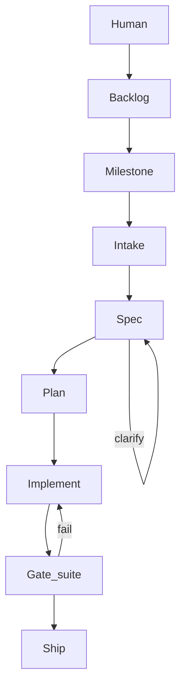

# Development workflow

Structured flow from task to merge. Works with any AI assistant — read [AGENTS.md](../../AGENTS.md) first.

## Principles

1. **Detect stack first** — run detect-stack, load `skills/stacks/<id>/`; never assume framework or hardcode commands.
2. **Spec before code** — write acceptance criteria; get human approval. See [SPECS.md](SPECS.md).
3. **Plan before code** — implementation plan after approved spec (non-trivial work).
4. **TDD by default** — tests trace to spec acceptance criteria. See [TESTING.md](TESTING.md).
5. **Comprehension before verify** — human understands what ships; handoff + Q&A. See [COMPREHENSION.md](COMPREHENSION.md).
6. **Review before commit** — completion verification by a **separate agent** first. See [VERIFICATION.md](VERIFICATION.md), then [REVIEW.md](REVIEW.md).
7. **Guidelines compound** — when AI repeats a mistake, record a finding, then a lesson, then (if shared) a catalog fingerprint.

## Feedback loop

Before plan, implement, verify, or review: read `.ai/work/{work_ref}-findings.md`. **block** + `open`/`regressed` has the same weight as spec acceptance criteria. Cite every such `F-*` in a remediations table. Writers never set `status: closed` — only `./scripts/kit findings close F-n --work-ref {work_ref} --from-sensor` after the sensor passes, or `./scripts/kit findings wontfix F-n --work-ref {work_ref} --human`. Verification runs `./scripts/kit findings gate --work-ref {work_ref}`, which exits non-zero while any `block` row is still open.

## Pipeline overview

Work flows from ideas to merge. Product slices use **milestones**; each task has a **pipeline stage**.



Live status (optional): `./scripts/kit status --watch` or `./scripts/kit board` (loopback `127.0.0.1` only).

## Intent classification

Classify every request before acting:

| Intent | Spec | Workflow |
|--------|------|----------|
| Feature (new) | Create v1.0 | Spec → Plan → TDD → Comprehension → Verification → Review → PR |
| Feature (update) | Bump version, actualize | Same |
| Bug (fix) | Bump version, actualize ACs | Analyze → Spec update → Fix → Comprehension → Verification → PR |
| Refactor | Only if behaviour changes | Test baseline → … |
| Audit | — | Scan → Report → Fix plan |
| Question | — | Read code, explain — no commits |

## Planning artifacts (`.ai/`)

Store session planning files in the **target project** (not in this kit repo). See [TRACKER.md](TRACKER.md) for `work_ref`, `spec_key`, and intake without MCP.

```
.ai/
  kit.yaml                  # optional — spec_language, process_references, gates, wiki_index
  tracker.yaml              # optional — provider, url_template (see docs/examples/tracker.yaml.example)
  index.md                  # optional — wiki_index: true (see SPECS.md § Index and log)
  log.md                    # optional — wiki_index: true
  specs/
    export-csv-spec.md        # current spec (spec_key lineage)
  archive/
    export-csv-spec.v1.0.md
  work/
    GH-58-analysis.md         # intake for current task (work_ref)
    GH-58-plan.md
    GH-58-handoff.md          # comprehension gate (tier ≥ standard)
    GH-58-verification.md
  pr-summary.md

  # Legacy GitHub-numeric (still supported):
  issue-42-spec.md
  issue-58-plan.md

  # No tracker:
  task-analysis.md
  task-spec.md
  task-plan.md
  task-verification.md
```

Add `.ai/` to the target project's `.gitignore` unless the team commits plans intentionally.

See [.ai/README.md](../../.ai/README.md) for artifact naming. Worked examples: [docs/examples/specs/](../examples/specs/README.md).

## Standard feature flow

### 1. Analyze

- Read the issue, ticket paste, or user request — see [TRACKER.md](TRACKER.md) intake ladder.
- **No MCP/API required:** paste ticket title and body into `.ai/work/{work_ref}-analysis.md` (or legacy `issue-{n}-analysis.md`, or `task-analysis.md`).
- Set **work_ref** (current task) and **spec_key** (feature lineage) in analysis header.
- Detect stack (`registry/stacks.yaml`, `scripts/detect-stack.sh`).
- Explore affected code.

### 2. Spec

- **New task:** create spec at version **1.0** — `.ai/specs/{spec_key}-spec.md` (recommended) or legacy `.ai/issue-{n}-spec.md` — [SPECS.md](SPECS.md).
- **Fix or update:** open existing spec by **spec_key**, bump version, Changelog, archive old file, actualize ACs.
- If `.ai/kit.yaml` sets `wiki_index: true`, update `.ai/index.md` and append to `.ai/log.md` in the same step — [SPECS.md § Index and log](SPECS.md#index-and-log).
- **Present spec to the human. Wait for approval before plan or code.**

### 3. Plan

- Produce `.ai/work/{work_ref}-plan.md` (or legacy `issue-{n}-plan.md`) with phases, files, and links to spec AC IDs.
- Set **Detail** to match task size — see table below (default: **standard**).
- **Present plan to the human. Wait for approval before production code.**

#### Plan detail levels

Match depth to task size. Shallow plans save tokens; deep plans save rework on complex tasks.

| Detail | When | Spec | Plan contents | Who reads plan |
|--------|------|------|---------------|----------------|
| **minimal** | One file, obvious fix, typo | Optional | Summary + 1–5 steps, no phases | Writer only |
| **standard** | Typical feature or fix | Required | Phases, files, AC mapping, stack | Writer; verifier skips plan |
| **detailed** | Multi-module, new patterns, multi-agent | Required | Standard + commands, order, risks, rollback | Writer; verifier still uses **spec** only |

**Token rule:** do not write **detailed** for **minimal** tasks. Do not write **minimal** when the task touches auth, money, or cross-cutting modules — use **standard** or **detailed**.

Example: [minimal plan](../examples/specs/issue-99-plan.minimal.example.md) · [standard plan](../examples/specs/issue-42-plan.example.md)

Plan template:

```markdown
# Plan: [name]

**Detail:** standard
**Spec:** specs/export-csv-spec.md **v1.1** (approved)
**Work ref:** GH-58

## Summary
What and why.

## Stack
Detected: [from stack profile]

## Implementation steps

*(omit or shorten for minimal)*

- [ ] …

## Phases
*(omit for minimal)*

### Phase 1 — [name] (S/M/L)
- [ ] …
- **Boundary:** *(detailed only)* modules/directories this phase may touch
- **Depends:** *(detailed only)* prior phases or external systems

## Consistency check
*(required for standard and detailed — before human plan approval)*

- [ ] Every spec AC ID appears in at least one phase or step
- [ ] Every phase/step maps to at least one AC (or is explicitly infra/chore with rationale)
- [ ] No AC left only in the spec

## Success criteria
- [ ] All spec AC IDs covered
- [ ] Tests + lint per VERIFICATION.md
- [ ] Gate suite from `.ai/kit.yaml` / [registry/gates.yaml](../../registry/gates.yaml) planned
- [ ] `process_references` honored (default `omit` — [AGENTS.md](../../AGENTS.md#shipped-language))
```

### 4. Branch

```bash
git checkout -b feature/short-description
```

Follow [GIT.md](GIT.md).

### 5. Implement

- TDD per [TESTING.md](TESTING.md) — tests map to spec acceptance criteria.
- Match [CODING.md](CODING.md) and project conventions.
- Small commits per [COMMITS.md](COMMITS.md).

### 6. Comprehension gate

**Mandatory for tier standard and strict** — see [COMPREHENSION.md](COMPREHENSION.md):

1. Writer produces `.ai/work/{work_ref}-handoff.md` (what changed, data flow, key files, decisions).
2. Agent generates comprehension Q&A (3 or 5 questions); **human answers** in own words.
3. Human runs **manual-verify** acceptance criteria from the spec.
4. Human completes **Human sign-off** in the handoff (files read, one-sentence explain, date).

Skip only when tier is **minimal** or human explicitly lowers tier with confirm.

**Do not commit** until sign-off is complete for the active tier.

### 7. Completion verification

**Mandatory.** Launch a **verifier agent in a new session** — see [VERIFICATION.md](VERIFICATION.md):

- Tests pass (stack profile commands)
- Linter / typecheck clean
- Documentation updated for public changes
- Implementation matches documentation
- Spec ACs satisfied (if spec exists)

Save report to `.ai/work/{work_ref}-verification.md` (or legacy `issue-{n}-verification.md`, or `task-verification.md`). **Do not commit while verdict is FAIL.**

### 8. Review

Follow [REVIEW.md](REVIEW.md) for security checklist and DoD (verifier may combine with step 6 in one fresh session).

### 9. Pull request

- Draft summary in `.ai/pr-summary.md`.
- Open PR with test plan checklist.

## Escalation (unknown tasks)

When official docs and codebase search do not resolve a question:

1. State what you tried and what you found.
2. Do not invent APIs or framework behaviour.
3. Ask the human how to proceed.

See the developer's `unknown-tasks` rule when present.

## Request validation

Before destructive, irreversible, or broad-scope actions, warn and confirm. See the developer's `request-validation` rule when present.

## Intent routing (plain text vs slash commands)

Users may describe tasks in natural language — **same workflow** as `/feature`, `/fix`, etc. Classify intent first; clarify if ambiguous; optional soft hint for commands. See [INTENT-ROUTING.md](INTENT-ROUTING.md).

## Tool-specific shortcuts (optional)

Some tools expose workflow shortcuts that encode this document:

| Tool | Mechanism | Phase |
|------|-----------|-------|
| Claude Code | Slash commands (`/feature`, `/fix`, …) | 2+ |
| Cursor | Skills, rules, agent prompts | 1+ |
| Any | Plain text → [INTENT-ROUTING.md](INTENT-ROUTING.md) | 1+ |

Prefer guidelines directly when no shortcut exists. **Do not require** slash commands for workflow.

## Definition of Done

- Universal: `registry/dod.yaml`
- Stack overlay: `skills/stacks/<id>/profile.yaml`
- Combined list: `.claude/stack.profile.json` → `dod_checklist`
